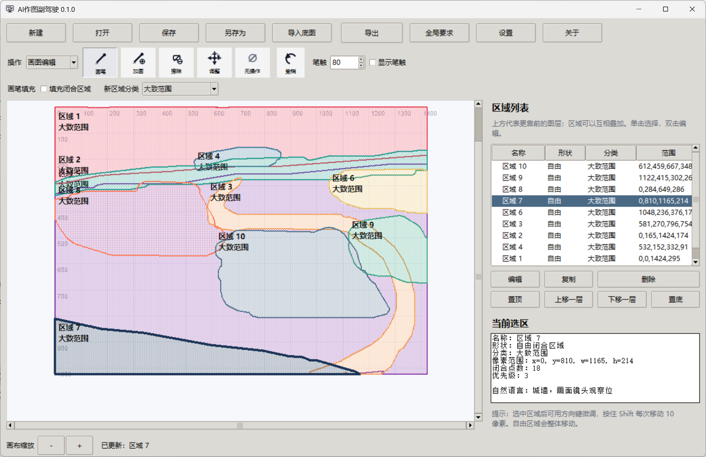
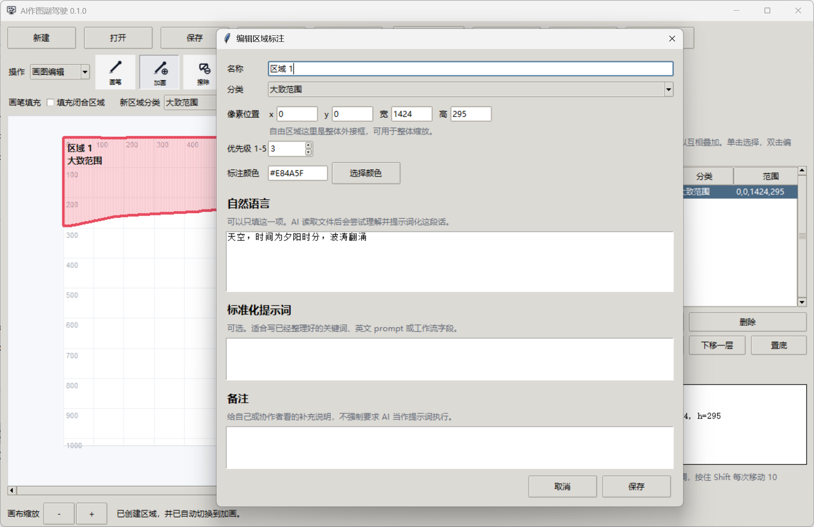

<div align="center">
  <strong>简体中文</strong> · <a href="./README.en.md">English</a>
</div>

# AI Drawing Copilot / AI 作图副驾驶

> **别再让生图模型猜你的构图。先把空间关系算清楚，再把图交给 AI。**

[](https://github.com/Iraryi/AI-Drawing-Copilot/releases/latest)
[](https://github.com/Iraryi/AI-Drawing-Copilot/releases/latest)
[](https://www.python.org/)

AI Drawing Copilot 不是另一个生图模型，而是位于**区域草图与生图模型之间的构图约束层**。你在画布上划出天空、河流、城堡、麦田等语义区域，程序负责计算它们之间的左右、上下、邻接、包含、交叠、图层、距离、画幅占位及长条走向，再把这些几何事实转换成明确、可检查、尽量不容忽略的自然语言构图要求。

它解决的不是“AI 不会画”，而是“AI 会画，却总把主体挪位、交换左右、改掉河流走向或破坏区域关系”。现阶段的生图模型通常不能仅凭坐标文件精确复现构图；本项目因此不把坐标原样丢给 AI，而是先用程序穷举并分析全部区域关系，再交付人能读、AI 也更容易执行的构图说明。

`区域草图 → 程序计算空间关系 → 强制构图说明与视觉索引 → 生图模型`

| 区域构图 | 关系描述引导后的结果 |
| --- | --- |
|  |  |

上图构图中，区域 3 是河流，区域 10 是稻田。程序会描述它们的画幅占位、相对方向、邻接关系以及河流的整体走向，而不只是输出一组坐标。

## 下载

Windows 用户可直接前往 [Releases](https://github.com/Iraryi/AI-Drawing-Copilot/releases/latest) 下载 `AIDrawingCopilot-Setup-0.2.0.exe`。

安装器支持中文与 English、普通安装与便携模式。首次启动主程序时选择界面语言，之后会自动记住，也可以随时在设置中更改。

## 使用方式

### 1. 划分并描述区域

创建画布或导入底图，用画笔、加画、擦除等工具划出区域，再填写区域名称和自然语言说明。标准化提示词和备注是可选项。



### 2. 选择面向不同 AI 的导出方式


- **给 AI 阅读 · 间接型（默认）**：输出强制构图说明、唯一索引色 PNG 与 SVG。AI 必须先用本地代码制作 `texture_underpaint.png`，停止并等待用户另发“继续”，然后才能生成最终图像。
- **给 AI 阅读 · 直接型**：允许立即生图，但全部构图关系仍是强制要求。
- **弱 AI 替代**：只输出 PNG 与 TXT。TXT 可选精简直接型、间接型和直接型，适合输入能力有限的 AI 或实验性流程。
- **给自动化工作流**：增加机器可读的结构文件，便于脚本继续处理。
- **完整交接包**：输出全部视觉、文字和结构材料。
- **只看视觉参考**：只生成编号 PNG 与 SVG。

视觉索引中的颜色只用于区分区域身份，不代表最终材质。即使所有区域都使用同一种参考色，导出时也会获得不同的索引色。

### 3. 交给具备文件读取能力的 AI

间接型流程需要 AI 具备本地代码调用能力；主流通用 AI 通常具备这类能力。提交文件时尽量不要附加会诱发立即生图的文字，让导出文件本身控制第一阶段。


直接型不要求代码调用，AI 会尝试直接生成图像，但构图稳定性可能较低，目前仍属于需要继续验证的模式。


## 为什么不能只给位置图或坐标

位置图能告诉模型“这里大概是什么”，却不保证模型会严格保持区域的大范围占位、边缘连接与两两关系。例如，原本要求位于河流左侧的麦田主体可能被画到河流右侧，顶部区域也可能被河水错误覆盖。

| 常见偏移 | 更严重的结构失控 |
| --- | --- |
|  |  |

本项目不能消除生图模型自身的能力上限，但会尽量把这些要求写得明确：不得交换左右和上下；不得取消邻接、包含或交叠；不得颠倒图层；不得把主体迁到画面另一侧；不得随意拉直、平移或改道河流、道路、城墙、山脊等长条区域。

## 当前测试范围与限制

- 当前流程仅在 **ChatGPT 5.5** 环境中完成实际测试，其他 AI 的文件读取、代码调用和生图行为可能不同。
- “给 AI 阅读”的默认间接型不能直接用于单纯生图模型，因为它包含代码制图和“继续”阶段门禁。
- 如果只有单纯生图模型，可以实验性地使用“弱 AI 替代”，或手动复制 TXT 内容并与 PNG 一起输入；效果不作保证。
- 输出是更明确的构图约束，不是像素级复刻承诺。最终结果仍受模型理解能力与生成随机性影响。

## 默认导出内容

“给 AI 阅读”默认只生成三个文件，避免技术材料喧宾夺主：

- `*.mandatory-composition-brief.md`：最高优先级的自然语言构图说明。
- `*.guide.png`：带编号、使用唯一索引色的点阵视觉索引。
- `*.regions.svg`：可交叉核对的矢量视觉索引。

若视觉索引与文字发生歧义，以强制构图说明为准。程序会分析全部 N×(N−1)/2 组两两关系，而不是只挑少量区域进行描述。

## 从源码运行

需要 Python 3.10+：

```powershell
py -3 -m pip install -r requirements.txt
py -3 main.py
py -3 tests\smoke_test.py
```

构建 Windows 直接运行版：

```powershell
powershell -ExecutionPolicy Bypass -File scripts\build_exe.ps1
```

构建安装器：

```powershell
powershell -ExecutionPolicy Bypass -File scripts\build_installer.ps1
```
